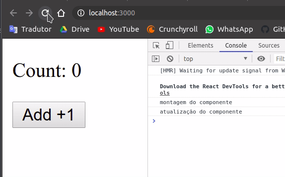

# Do que se trata esse repositório
Aqui vou criar e descrever um pequeno projeto com o objetivo de complementar meus estudos em react, mais especificamente com os react-hooks.
Para tal, irei criar vários projetos, cada um para um determinado hook.

[Link para a documentação](https://pt-br.reactjs.org/docs/hooks-intro.html)

# O que instalar
- [NodeJS](https://nodejs.org/en/)
- [yarn - opcional](https://yarnpkg.com/)

# O que são os hooks
Os hooks permitem que a aplicação se ligue aos estados e ciclos de vida do react, a partir de componentes funcionais.
De uma forma mais simples, isso quer dizer que os hooks interagem com nossa aplicação de forma dinâmica, controlando variáveis ou ações.

# Comum a todos os projetos
Para todos os projetos será necessário digitar 
```sh
$ yarn create react-app NOME_DO_PROJETO
```

Sendo que onde está `NOME_DO_PROJETO` você deve trocar pelo nome do projeto em questão

Para inicializar os projetos, entre na pasta do mesmo pelo terminal e utilize o comando 
```sh
$ yarn start
```

Todos os projetos serão simples, e sem estilizações. Tendo a finalidade exclusiva de estudar os hooks. Logo alguns arquivos gerados pelo `create react-app` serão apagados. São eles:

```sh
NOME_DO_PROJETO/src/App.css
NOME_DO_PROJETO/src/App.test.js
NOME_DO_PROJETO/src/index.css
NOME_DO_PROJETO/src/logo.svg
NOME_DO_PROJETO/src/setupTests.js
NOME_DO_PROJETO/src/serviceWorker.js
NOME_DO_PROJETO/README.md
```
O arquivo `App.js` ficará com o seguinte código inicial

```JavaScript
import React from 'react';

function App() {
  return (
    <div>
      Olá mundo
    </div>
  );
}

export default App;
```

E o arquivo `index.js` ficará:

```JavaScript
import React from 'react';
import ReactDOM from 'react-dom';
import App from './App';

ReactDOM.render(
  <React.StrictMode>
    <App />
  </React.StrictMode>,
  document.getElementById('root')
);
```

Todo hook do react é importado da seguinte forma

```JavaScript
import {nomeDoHook} from 'react';
```

Claro que como o react sempre deve ser importado também, teremos sempre:

```JavaScript
import React, {nomeDoHook} from 'react';
```

# Projeto use-state

## Utilidade do hook
O useState serve para guardar um estado. De forma simples, ele guarda o valor de uma váriavel e também pode alterá-la.

O use state possui a seguinte sintax:

```JavaScript
const [variable, setVariable] = useState(initialValue);
```

Ou seja, o useState retorna um array com o valor da variável e uma função para controlá-la e também define um valor inicial para essa variável.

Caso queira modificar o valor de `variable` basta usar a função `setVariable` da seguinte forma:

```JavaScript
setVariable(NOVO_VALOR);
```

O legal disso é que sempre que o valor for alterado o react irá reenderizar a DOM automaticamente.

## O projeto
Dentro do arquivo App.js vamos escrever um projeto simples, que terá um botão que quando clicado irá mudar o valor o valor da variável retornada pelo hook. Esse valor irá aparecer em um texto logo acima do botão

```JavaScript
import React, {useState} from 'react';

function App() {
  const [count, setCount] = useState(0);
  return (
    <div>
      <p>Count: {count}</p>
      <button onClick={() => setCount(count + 1)} >Add +1</button>
    </div>
  );
}

export default App;
```


# Projeto use-effect
## Utilidade do hook
é um hook de efeito. Sempre que algo pré-determinado acontecer na aplicação ele irá executar

Esse hook consegue exercer duas funções diferentes (que me interessam kkk)

### Na montagem do componente
```JavaScript
useEffect(() => {
  código...
}, []);
```

Com essa sintaxe ele executa o código assim que o componente é montado.

### Na atualização do componente

```JavaScript
useEffect(() => {
  código
}, [vigia]);
```

Com essa sintaxe ele executará assim que a variável `vigia` for modificada, fazendo com que o `código` será executado.

## O projeto
Vou construir uma aplicação dentro do `App.js` que mostrará alguns `console.log` somente para poder compreendermos como funciona

```JavaScript
import React, {useState, useEffect} from 'react';

function App() {
  const [count, setCount] = useState(0);
  
  useEffect(() => {
    console.log('montagem do componente');
  }, []);
  
  useEffect(() => {
    console.log('atualização do componente');
  }, [count]);

  return (
    <div>
      <p>Count: {count}</p>
      <button onClick={() => setCount(count + 1)} >Add +1</button>
    </div>
  );
}

export default App;

```



Veja que no inicio ele também mostra a atualização do componente, mas isso é porque assim que o componente é gerado o valor de `count` é atribuído, logo isso é uma mudança na variável, por isso ele executa.


# Projeto use-context

## Utilidade do hook
Para quando queremos que uma árvore de componentes tenha acesso a determinadas propriedades. Ou seja, com isso evitamos de ficar passando `props` nos componentes. Uma coisa muito boa, é que caso o valor do contexto seja alterado todos os lugares envolvidos por ele serão renderizados novamente.

> Porém vale ressaltar que essa solução se aplica apenas para componentes dentro da mesma árvore de componentes. E que se deve ter um certo cuidade com isso, pois pode prejudicar a reutilização de componentes.

Para indicar sua utilização, vou pegar o exemplo da propria documentação do react.

```JavaScript
// cria um objeto para ser nosso contexto
const themes = {
  light: {
    foreground: "#000000",
    background: "#eeeeee"
  },
  dark: {
    foreground: "#ffffff",
    background: "#222222"
  }
};

// cria o contexto utilizadno um objeto default
const ThemeContext = React.createContext(themes.light);

// app principal envolvido no provider do contexto
function App() {
  return (
    <ThemeContext.Provider value={themes.dark}>
      { /* chama um componente filho */ }
      <Toolbar />
    </ThemeContext.Provider>
  );
}

function Toolbar(props) {
  return (
    <div>
      { /* chama um terceiro nivel de componente */ }
      <ThemedButton />
    </div>
  );
}

function ThemedButton() {
  // usa o hook para invocar o contexto criado lá no primeiro nivel
  const theme = useContext(ThemeContext);
  return (
    <button style={{ background: theme.background, color: theme.foreground }}>
      I am styled by theme context!
    </button>
  );
}
```

`themes.light` não é o valor que chegará ao `ThemedButton`, o valor que chegará lá é o `themes.dark`. Porém caso o `ThemedButton` requera algo que não corresponda ao que foi passado como atributo no provider então o valor defaul é utilizado (caso tenha correspondencia com ele).

## O projeto
Aqui farei a mesma coisa que o exemplo da documentação, porém de um jeito mais legal, e mostrando a funcionalidade de reload automatico entre componentes que participam do provider.

Para isso eu criei dois componentes de botão, ambos com códigos muito parecidos, compartilhando o mesmo contexto, porém um deles possui a função de modificar os valores do contexto. Assim que os valores são modificados o outro botão também recarrega com os novos valores.

> OBS 1.: mesmo que o segundo componente não utilizasse o useContext ele iria recarregar, isso porque ele entá dentro do provider.

> OBS 2.: Veja que se colocarmos o provider envolvendo todo o nosso App a aplicação inteira irá recarregar sempre que algo for alterado. Logo tome cuidado com isso.

- Definindo o tema inicial em `Themes.js`
```JavaScript
export default {
    light: {
        foreground: "#000000",
        background: "#eeeeee"
    },
    dark: {
        foreground: "white",
        background: "black"
    }
};
```

- Criando um contexto nulo em `Context.js`
```JavaScript
import React from 'react';
  
const ThemeContext = React.createContext(null);

export default ThemeContext;
```

- Colocando o provider do contexto dentro do `App.js`
```JavaScript
import React, {useState} from 'react';
import Button from './Button';
import Button2 from './Button2';
import ThemeContext from './Context'
import themes from './Themes';

function App() {
  const [theme, setTheme] = useState(themes);

  return (
    <ThemeContext.Provider value={{theme, setTheme}}>
      <Button />
      <Button2 />
    </ThemeContext.Provider>
  );
}

export default App;
```

> Veja que o valor encaminhado para frente foi a variável e a função do useState, o que nos permitirá executar o setTheme nos componentes abaixo e assim propagar essa mudança por toda a árvore de componentes

- Criando o botão de modificação em `Button.js`
```JavaScript
import React, {useContext} from 'react';
import ThemeContext from './Context'

const Button = (props) => {
    const theme = useContext(ThemeContext);
    const newTheme = {
        light: {
            foreground: "#000000",
            background: "#eeeeee"
        },
        dark: {
            foreground: "#ff79c6",
            background: "#282a36"
        }
    };

    return (
        <button style={{ background: theme.theme.dark.background, color: theme.theme.dark.foreground }} onClick={() => theme.setTheme(newTheme)}>
            Primeiro Botão
        </button>
    );
}

export default Button;
```

- Criando o outro botão que serve somente para mostrar a funcionalidade em `Button2.js`
```JavaScript
import React, {useContext, useEffect} from 'react';
import ThemeContext from './Context'

const Button2 = (props) => {
    const theme = useContext(ThemeContext);
    console.log('aqui');
    
    return (
        <button style={{ background: theme.theme.dark.background, color: theme.theme.dark.foreground }}>
            Segundo botão
        </button>
    );
}

export default Button2;
```


# Projeto use-reducer
## Utilidade do hook
Ele funciona de auternativa ao useState, ele serve para guardar estados. E se torna preferível ao useState quando se tem uma lógica de estados complexas acontecendo dentro do componente.

Se já ouviu falar de redux, isso aqui vai parecer bastante, mas acontece que o useReducer é mais recomendado para trabalhar dentro de um componente, e o redux para gerenciar os estados de toda a aplicação. Claro que se utilizarmos o useReducer em conjunto com o useContext teremos uma coisa bem proxima ao redux, mas tudo depende do como você irá implementar isso.

para utilizar o hook escreva o código com a seguinte estrutura:

```JavaScript
import React, {useReducer} from 'react';

const initialState = {/*objeto com os valores iniciais*/}

const reducer = (state, action) => {
  switch (action.type) {
    case 'instrução_passada_pela_action':
      return {/*modificação no state*/};
  }
};

function App() {
  const [state, dispatch] = useReducer(reducer, initialState);

  return(
    // codigo jsx
  )
}

export default App;
```

utilize a função `dispatch` para poder modificar o valor do state de acordo com alguma action.

```JavaScript
() => dispatch({type: 'instrução'})
```

## O projeto
Vou fazer um contador simples utilizando o hook.

```JavaScript
import React, {useReducer} from 'react';

const initialState = {count: 0}

const reducer = (state, action) => {
  switch (action.type) {
    case 'increment':
      return {count: state.count + 1};
    case 'decrement':
      return {count: state.count - 1};
    default:
      throw new Error();
  }
};

function App() {
  const [state, dispatch] = useReducer(reducer, initialState);

  return(
    <>
      Count: {state.count}
      <div>
        <button onClick={() => dispatch({type: 'decrement'})}>-</button>
        <button onClick={() => dispatch({type: 'increment'})}>+</button>
      </div>
    </>
  )
}

export default App;
```


# Projeto use-callback
## Utilidade do hook
Quando uma função é criada na memoria ela ocupa um espaço, e nisso ela ganha uma referênica. e o compartivo entre funções é feito exatamente comparando a referência, ou seja, se o ponteiro de duas funções apontarem para o mesmo endereço elas são logicamente iguais. Porém, a cada render do react a função é recreada, o que faz a referencia mudar.

olhando isso na pela óptica de um exemplo. (que será o nosso projeto)

suponha um componente pai e dentro um componente filho, esse componente filho recebe uma função por meio das `props`, e sempre o que reenderiza ele tb precisa ser reenderizado. Até ai tudo normal, mas você nota que não precisa reenderizar o filho sempre, então coloca em torno de um `memo`, que irá impedir o filho de reenderizar quando as `props` atuais forem iguais as anteriores. Porém ele continua reenderizando sempre.

Isso acontece pois a função que é passada por `props` não está dentro de um `useCallback`, logo sempre que o componente pai recarregar a função modifica a referência e o `memo` pensa que a prop mudou. Mas se colocarmos essa função dentro do `useCallback` ele verificará que nenhum atributo da função foi modificado, logo ele não precisa reconstruir a função, e isso impede que a referência da função seja modificada e assim o `memo` pega a igualdade da prop e evita o render do filho.

Em resumo, o `useCallback` evita recrear uma função de forma desnecessária.

Para utilizar o hook:

```JavaScript
const memorizedCallback = useCallback(
  () => {
    doSomething(a, b);
  },
  [a, b],
);
```

agora ao em vez de chamar por `doSomething` você chama por `memorizedCallback`. Ou seja, o use callback retorna uma função que executa a mesma coisa que a função dentro dele, porém essa nova função pode ou não ter outra referência dependendo se os parâmetros dentro de colchetes foram modificados.

- [Recomendação](https://www.youtube.com/watch?v=RZG0iRfUaY0)

## O projeto
Criarei um contador, mas dividido em dois arquivos, sendo um o componente botão que não irá reenderizar toda vez. mas também preciso usar o `memo`.

- Button
  ```JavaScript
  import React, {memo} from 'react';

  const Button = memo(({increment}) => {
    console.log('render');
    return(
      <div>
        <button onClick={() => increment()}>Add + 1</button>
      </div>
    );
  }
  )

  export default Button;
  ```

- app
  ```JavaScript
  import React, {useState, useCallback} from 'react';
  import Button from './Button';

  function App() {
    const [count, setCount] = useState(0);
    
    const increment = useCallback(() => {
      setCount(value => value + 1);
    }, []);

    return (
      <div>
        <p>Count: {count}</p>
        <Button increment={increment} />
      </div>
    );
  }

  export default App;
  ```


Veja que o render aparece uma unica vez e depois não precisa mais. pq a função não mudou, logo o que chega no Button também não mudou. se eu passasse direto o setCount pro componente Button, ele iria reenderizar mesmo com o memo.

# Projeto use-memo
## Utilidade do hook
funciona de forma identica ao useCallback, porém ele não retorna uma função com mesma referência, ele retorna o valor retornado por aquela função e evita que ela seja executada novamente caso seja desnecessário.

para utilizar:

```JavaScript
const memoizedValue = useMemo(() => computeExpensiveValue(a, b), [a, b]);
```

## O projeto
novamente vamos fazer um contador. mas dessa vez também mostraremos qual a maior palavra dentre duas palavras de um array.

```JavaScript
import React, { useState, useMemo } from "react";

function computeLongestWord(data) {
  console.log('verificando palavras');
  if (data[0].lenght > data[1].lenght){
    return data[0];
  } else {
    return data[1];
  }
}

const data = ['palavra', 'outra palavra']

const App = () => {
  const [count, setCount] = useState(0);

  const longestWord = useMemo(() => computeLongestWord(data), [data]);

  return (
    <div>
      <div>count: {count}</div>
      <button onClick={() => setCount(count + 1)}>increment</button>
      <div>{longestWord}</div>
    </div>
  );
};

export default App;
```


Veja que a função `computeLongestWord` não é executada toda vez que adicionamos um novo valor ao contador, o que gera um novo render. porém como o use memo viu que `data` não mudou nada desde o ultimo render, ele não disparou a função `computeLongestWord`.

Isso não aconteceria se o `data` tivesse sido declarado dentro da app, pois o `data` seria recriado sempre, e isso faria com que o use memo acreditasse que houve mudança.

# Projeto use-ref
## Utilidade do hook
Ele serve para definir referências para coisas do nosso componente, sendo isso uma função ou então um conponente dentro do componente. E depois podemos resgatar essa referência em algum outro lugar.

```JavaScript
const refContainer = useRef(initialValue);
```

## O projeto
Aqui vamos referenciar um componente do nosso componente, e vamos executar uma modificação nele sem chamá-lo diretamente, vamos chamá-lo pela sua referência. Essa ação será simplesmente dar o foco ao input após clicar no botão.

```JavaScript
import React, {useRef} from 'react';

function App() {
  const inputEl = useRef(null);
  const onButtonClick = () => {
    inputEl.current.focus();
  };
  return (
    <>
      <input ref={inputEl} type="text" />
      <button onClick={onButtonClick}>Focus no input</button>
    </>
  );
}

export default App;

```


# Projeto use-imperative-handle
## Utilidade do hook
## O projeto


# Projeto use-layout-effect
## Utilidade do hook
## O projeto


# Projeto use-debug-value
## Utilidade do hook
## O projeto


